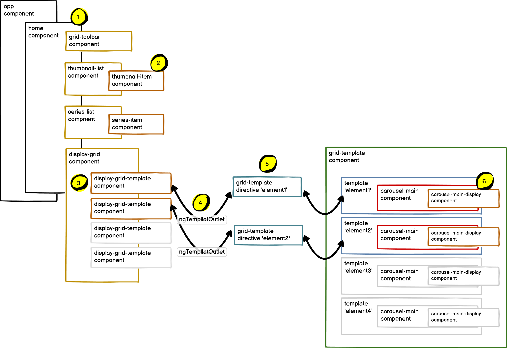
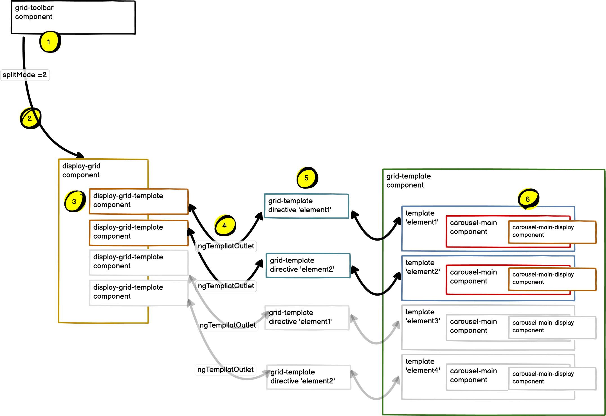
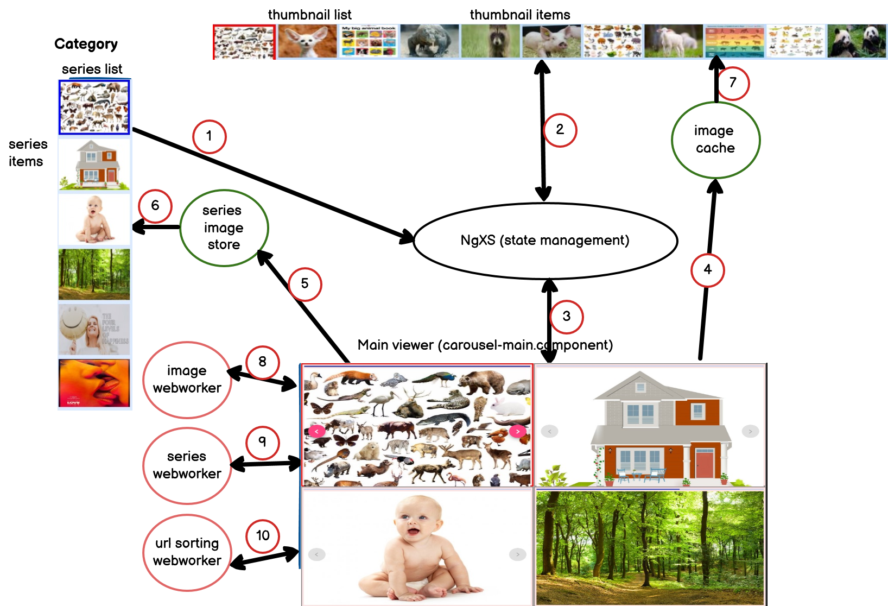

# SplitWindow220225

This project was generated with [Angular CLI](https://github.com/angular/angular-cli) version 12.2.0.

## Summary
* This program combines and applies the Angular technologies that have been applied when performing the previous project.
  It aims to implement various image categories quickly and in grid format in real time.
* Create a file in advance that stores the url of the image by crawling by image group (category) in Google,
  The image is read in real time with the image url in this file.
* Since there is no separate backend server, the status of the image server and
  depending on the traffic situation, the loading speed for each image may differ significantly.
* Since it takes a lot of time to load the image, webworker technology is applied to compensate for this.
* And, once read images are stored by applying a cache to display them quickly later.
* The user selects one group (category), and while the image is caching, another group is selected.
  Since it is selectable, webworker technology is applied to prevent the image display time from being delayed at this time.
  Then, even if another category is selected while loading the image of the previously selected category,
  program was developed to enable image loading by immediately changing to another group.

## Component Relations Diagram

~~~
1. All components are configured as children of Home component.
  The event of the children component is transmitted to the Home component, and all events are controlled there.
2.Thumbnail list consists of thumbnail items expressing thumbnail images as children.
  Series list consists of series items representing series (category) images as children.
3.In order to express the split window selectively (1~4 pieces), the component expressing each template is composed of child.
  display-grid.component.ts
4.Since the selection of the split window can be varied, this part is connected to the template.
  So, connect to ngTemplateOutlet. In the figure, two split windows are selected.
  display-grid-template.component.ts
5.Since there are several templates and they are selectively configured in various ways, they are configured as directives to group them.
  grid-template.component.ts
6.carousel-main-display.component is a child component that displays only images.
~~~
## Component connections Diagram

~~~
1.Select the second item from the toolbar menu. splitmode =2 The value is stored in state management.
2.The display-grid component is called with this value.
3.Based on this value, 2 display-grid-template components out of 4 grids are created, respectively.
4.A grid-template directive is connected to each display-grid-template component.
5.The grid-template directive is linked to the template in the grid-template component.
6 Since this template includes carousel-main component, carousel-main.component is created.

The above sequence proceeds automatically at once and the carousel-main component operates.
Since splitMode = 2, two carousel-main components each have element Id 'element1',
Operation starts based on the value of 'element2'.
Each carousel-main component waits for each other, and when the previous carousel-main component completes its operation, 
it automatically operates according to its own order..
~~~

### Caching image
* Since the user can randomly select an image category, all categories are in one cache.
  Save the images regardless of the order and category in which they are read,
* When displaying images for each group, the cached images were implemented to
  select and display only the group.
* At this time, it takes a lot of time to sort by category, so by applying webworker technology,
  program was made it possible to select by category.
* When the user selects a category, if there is already caching for that category
  display the data, and if there is images that has not yet been loaded in that category
  reading images from server and caching is also carried out concurrently.
### Split window
* The grid (window split) function is difficult to customize when using the existing library.
  Implemented by applying directive.
* When implementing a split window, each split window needs the process of displaying each image group (category).
  At this time, only the first image of images in each window is displayed first, and when that operation (the first image is displayed)
  is finished, immediately The next split window starts working.
* Each split window consists of a separate component. Therefore, each split window
  must have its own variable. A unique variable for each split window is kept in the service program.
  This is the difficult part of the program. [Details](src/assets/md/grid.md)

* Each split window is assigned by category, and each split window
  The start and end points of drawing should be stored in global variables.
* Therefore, each split window decides by itself whether the previous split window has finished its work.
  When the previous split window has finished image processing, draw the first image of it's category,
  When the image drawing is completed, the state is immediately stored in a global variable.
  Then, the next split window waits and starts drawing the image for that category.
* And, from the second image, caching and saving work is also carried out by webworker as a background job at the same time.
* Only through this process can each split window maintain its own id.
  It is possible to control each split window.

## Overall diagram

* Series list: Image list displayed by category on the left side of the screen
* Thumbnail list: Image list displayed by category at the top of the screen
* Main viewer: The part where the selected image is displayed from among the
  images separated by category and in the middle on the screen
* When split window is selected, it is displayed separately in grid form.
~~~
Below seq. no is related with above diagram.
1: If category is selected, the selected information is transmitted.
2: When the thumbnail information is updated, the thumbnail list recognizes this.
3: The information received in step 1 is transmitted to the carousel-main program
   through the status information.
4: The information passed to carousel-main is checked after identifying the 
   information stored in image-cache. If it is not saved, the image is read through 
   the image webworker and stored in the image cache.
5: When the program is first started, the image is read through the webworker 
   and then stored in the image store.
6: Images stored in the image store are displayed as a series (category) list.
7: As the image url is stored in NgXS and the state (NgXS) changes at the same time,
   the thumbnail list display program operates.
   Displays images stored in the cache as thumbnails.
8: When each window (split window) operates, the webworker for each window operates
   image reading is performed from the server.
9: Because the image display operation is delayed by continuing only the image
   loading operation.
   In order to naturally display only the first page on the screen, cache the 
   rest of the pages by using webworker function
10: Images are stored uncategorically in the cache.
   When displaying on the screen, sorting by the selected category is performed 
   using a separate webworker.
~~~

### Main applied technology
* Angular: ver 12.2.0
* Storybook: ver 6.4.9
* Tailwindcss: ver.3.0.4
* Angular Material ( cdk, grid...)
* RxJS: ver 6.5 (Reactive programming library)
* NgXS: (Redux: State Management Library)
* Webworker: Observable-webworker (RxJS oriented webworker)
* TDD: spectator ( Angular oriented TDD development tool)

#### Deploy information

ng build --base-href "https://wsjung0516.github.io/split-window220225/"
npx ngh --dir=dist/split-window220225
if above command is now working, please refer following site --> https://github.com/angular-schule/angular-cli-ghpages

